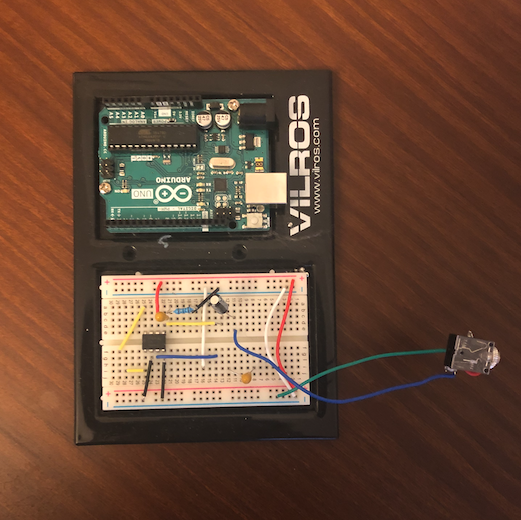
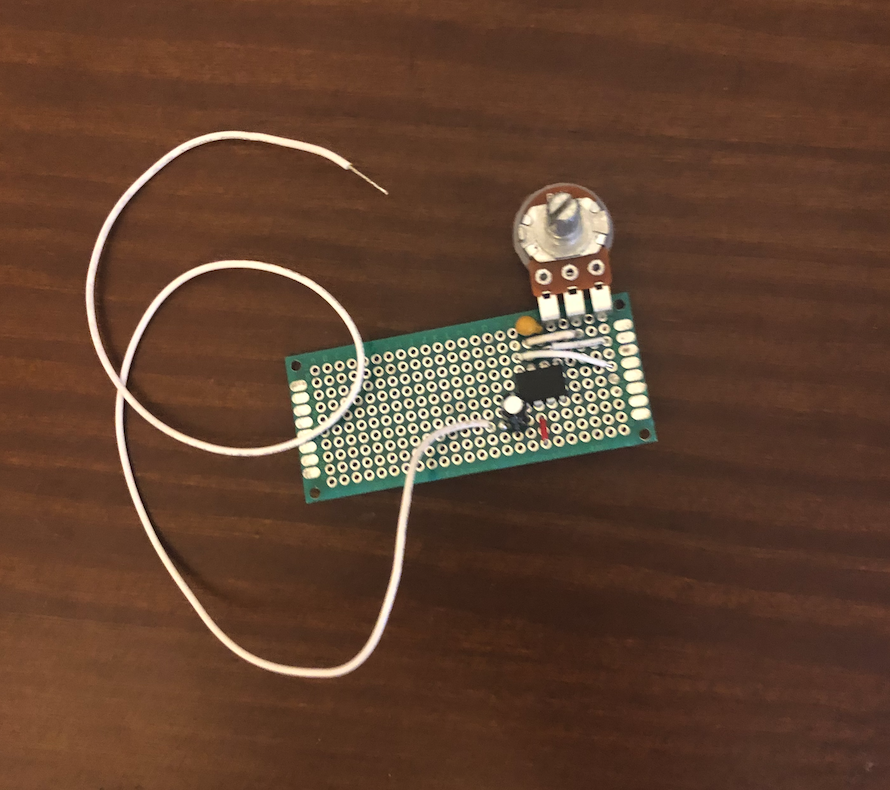
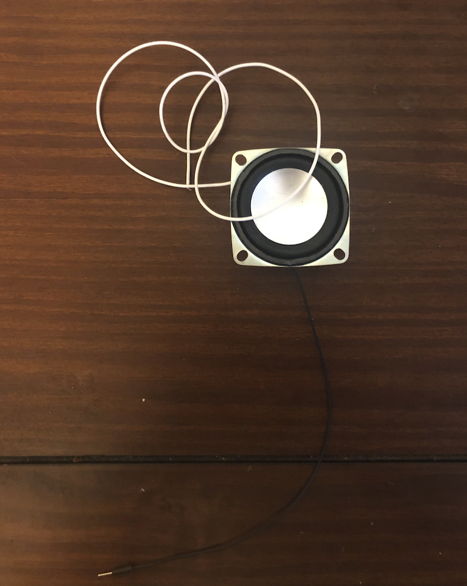
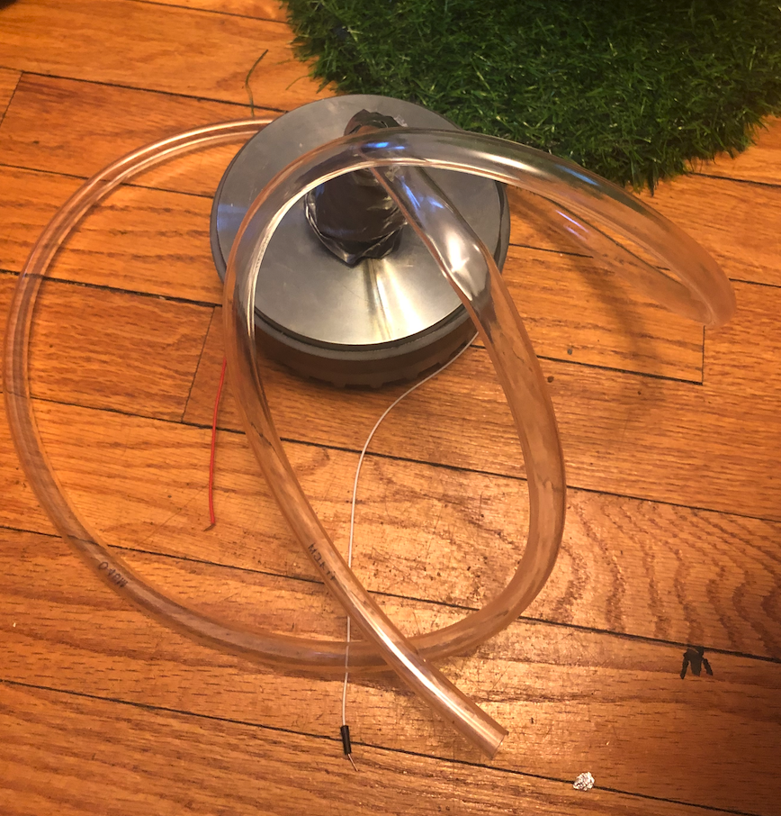

# The Talk Box

The talkbox takes a signal from an audio device, amplifies it, and outputs it through a compression driver. I built the amp here following this guide, but I didn’t have the right components so this was just a starting point. Here’s what the amp looks like: 

After I got the amp working I soldered my components onto some pcb:

It took me a while to figure out how to build the talk box, I was trying to use an arduino to send audio for a long time but this didn’t work. I found that using the amp was much more efficient. 

Originally I was using some little speakers for my talk box:

These speakers worked great for getting some sound to play. Part of the issue is that these speakers are fairly quiet. I wrapped these speakers up in a duct tape container and tried to send sound out of a tube, no luck. I did some research and found that everyone in talkbox building uses a compression driver. A few days later I was ready to go deaf because this thing was LOUD. I managed to get it working but I was still losing too much sound to really get a good talkbox effect. My solution was to attach my tubing using tubing. I cut small sections of tubing to help make a good seal with the compression drive. I did have to wrap all this in duct tape to keep it from unraveling, and for the *aesthetic*. Now I had a working talk box:

